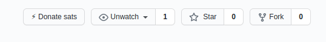

# LN donate

Browser extension allowing you to donate satoshis to GitHub-hosted projects using Lightning Network.

## About

This is a browser extension that uses PoC idea of having `.lndonate` file in project top-level directory to generate additional Lightning donation button on GitHub.
It can be considered a libre alternative to GitHub native government shitcoin donation button.
The button shows up near other buttons - where government shitcoin donate button would appear.

### Screenshot



## Usage - donor

The extension is currently unreleased - you need to load it in debug mode (`about:debugging` in FF).
After the extension is loaded you only need to visit GitHub page of a project that supports this and the donate button will appear.
The button attempts to open a wallet using `lightning:` scheme - make sure you have an appropriate wallet installed.

## Usage - receiver

If you want to receive donations you need lnurl-pay link.
Add `.lndonate` file to your project, into `master` branch:

```
# You may add arbitrary comment here - such as a link to this repository to explain the file. :)
# Empty lines and unknown keys are also OK

lnurlp=lightning:yourlnurl-pay
```

After it's pushed you should see the button appear if you have the extension installed.

## Acknowledgement

Thanks a lot to Dominik who did most of the development of this extension.

## Why this project doesn't contain valid URL?

I don't have lnurl-pay server yet. WIP. :D
